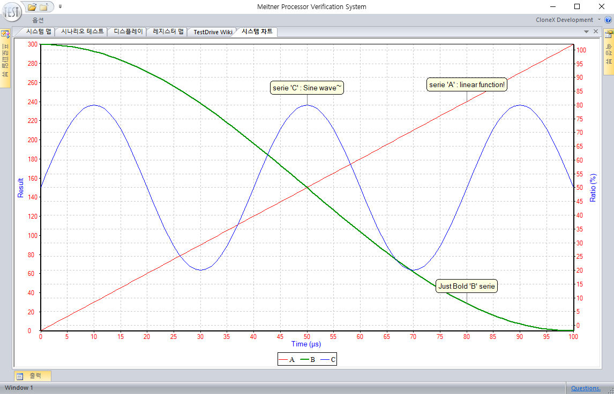

# Document Profile : System Chart

| | |
| ------------: | ------------ |
| **Name**  | System Chart / Gráfico del sistema / 시스템 차트 / システムチャート |
| **Path**  | %TESTDRIVE_PROFILE%/Common/SystemChart  |
| **Language**  | English / español / 한국어 / 日本語  |
| **Profile View** | System :fa-angle-right: System chart  |



S/W 응용 프로그램이나 H/W 모듈에서 Verilog DPI 를 통해 쉽게 차트를 생성하고 기록할 수 있도록 합니다.
하위 내용은 Source forge 에서 다운 받을 수 있는, 예제 테스트 프로젝트인 "Meitner" 를 기반으로 설명하고 있습니다.

### 1. 소스 참조 위치

각각의 소스 위치는 아래와 같다.

S/W 응용 프로그램 참조 소스 : 
`%PROJECT%Application/Example/Testbench/framework/Chart.cpp`
`%PROJECT%Application/Example/Testbench/framework/Chart.h`

이 경우 makefile 에 Chart.cpp 를 포함하고, 구현부 소스에 #include "Chart.h" 를 삽입하여 사용하면 된다.
"3. 예제"에서 실제 구동 설명을 보이고 있다.

H/W 모듈 Verilog DPI 참조 소스 : 
`%PROJECT%System/HDL/dpi/Chart.cpp`
`%PROJECT%System/HDL/dpi/Chart.h`

dpi 소스의 경우 자동으로 Chart.cpp 를 포함하므로, 원하는 구현부 소스에 #include "Chart.h" 를 삽입하여 사용합니다.


### 2. 메소드 설명

Chart.h 는 아래와 같은 메소드들을 가집니다.
Chart에 대한 인스턴스를 선언하고, 아래의 메소드들을 호출합니다.
여러 인스턴스를 선언하더라도 오직 한개의 차트 도큐먼트에 대해서 제어를 합니다.

객체 선언
	Chart  인스턴스_이름;

`BOOL Initialize(void);`
> 차트의 초기화를 위해 한번 선언해야 합니다.
* TRUE 를 반환할 경우 TestDrive 상에 Chart 가 존재하는 것입니다.

`void CreateSerie(DWORD dwID, const char* sName = NULL, CHART_STYLE style = CHART_STYLE_LINE, BOOL bSecondaryHorizAxis = FALSE, BOOL bSecondaryVertAxis = FALSE);`
> 차트 시리즈를 생성한다.
* dwID		: 시리즈 번호(0,1,2,... 순서로 기입한다. 이 값은 다른 함수에서 시리즈를 대표한다.)
* sName	: 시리즈 이름
* style		: 시리즈 스타일, 다음 중 하나를 선택한다.
 CHART_STYLE_POINT			: 포인트 스타일
 CHART_STYLE_LINE			: 라인 스타일
 CHART_STYLE_SURFACE		: 서피스 스타일
 CHART_STYLE_BAR				: 바 스타일
 CHART_STYLE_CANDLESTICK		: 캔들스틱 스타일
 CHART_STYLE_GANTT			: 간트 스타일
* bSecondaryHorizAxis
 : TRUE 일 경우 차트의 위쪽 축을 사용하고, FALSE 일 경우 아래 축을 사용한다.
 (현재 위쪽 축은 지원하지 않으므로, 항상 FALSE 를 기입한다.)
*  bSecondaryVertAxis
 : TRUE 일 경우 오른쪽 축을 사용하고, FALSE 일 경우 왼쪽 축을 사용한다.


`void RemoveSerie(DWORD dwIndex = (DWORD) - 1);`
> 차트의 특정 시리즈를 제거한다.
* dwIndex	: 제거할 시리즈의 번호. 이 값이 -1 일 경우엔 모든 시리지를 제거한다.

`void SetName(DWORD dwID, const char* sName);`
> 시리즈 이름을 변경한다.
* dwID		: 변경한 시리즈의 번호
* sName	: 새로운 이름

`void AddPoint(DWORD dwID, double Xvalue, double Yvalue);`
> 지정한 시리즈에 값 하나를 추가한다.
* dwID		: 추가할 시리즈의 번호
* Xvalue	: X 축 값
* Yvalue	: Y 축 값

	

`void AddPointArray(DWORD dwID, DWORD dwCount, double* pXvalues, double* pYvalues);`
> 지정한 시리즈에 여러 값을 추가한다.
* dwID		: 추가할 시리즈의 번호
* dwCount	: 추가할 시리즈 개수
* pXvalues	: X 축 값 배열
* pYvalues	: Y 축 값 배열


`void SetLabel(DWORD dwID, DWORD dwIndex, const char* sLabel);`
> 시리즈의 특정 값에 라벨을 추가한다.
*dwID		: 시리즈의 번호
* dwIndex	: 데이터가 저장된 인덱스 번호, 
 (X 축 값이 아니라, 입력 순서에 따른 번호이다.
  0,1,2,3~ 입력 순서로 번호가 매겨진다.)
* sLabel	: 추가할 라벨


`void SetWidth(DWORD dwID, int iWidth);`
> 시리즈의 굵기를 변경한다.
* dwID		: 시리즈의 번호
* iWidth	: 시리즈 굵기 (기본 1)


`void SetSmooth(DWORD dwID, BOOL bSmooth);`
> 스플라인 곡선으로 데이터 이음선을 그린다.
* dwID		: 시리즈의 번호
* bSmooth	: 스플라인 곡선 사용 여부


`void SetForeground(void);`
>차트 도큐먼트를 맨 앞으로 옮겨 보이게 한다.
	차트 도큐먼트가 활성화 되지 않았을 경우 무시된다.


### 3. 예제

`%PROJECT%Application/Example/Testbench/ChartTest` 예제를 설명한다.
실행은 프로파일 뷰에서 먼저 "System/System chart" 를 실행합니다.
```cpp
#include "Chart.h"
#include <math.h>

int main(int argc, const char* argv[])
{
	Chart	chart;
	chart.Initialize();				// initialization of chart
	chart.SetForeground();		// set chart document to foreground
	{
		chart.RemoveSerie();		// remove all series
		chart.CreateSerie(0, "A");	// Add Serie 'A'
		chart.CreateSerie(1, "B");	// Add Serie 'B'
		chart.CreateSerie(2, "C", CHART_STYLE_LINE, FALSE, TRUE);	// Add Serie 'C' (%)
		chart.SetWidth(1, 2);

		for(int i = 0; i <= 100; i++) {
			chart.AddPoint(0, i, i * 3);	// "A"
			chart.AddPoint(1, i, i * 2);	// "B"
			chart.AddPoint(2, i, sinf(3.141592f * i / 20) * 30 + 50);	// "C"
		}

		chart.SetLabel(0, 50, "Middle of line!");
		chart.SetLabel(1, 50, "Just Bold 'B' serie");
		chart.SetLabel(2, 50, "Sine wave~");
	}
	return 0;
}
```
이 프로그램은 프로파일 뷰에서 "Example/Testbench/Chart test" 를 클릭하여 실행할 수 있습니다.
실행하게 되면 아래와 같이 프로그램의 실행에 따라 실시간으로 결과를 보임을 확인 할 수 있습니다.

### [:fa-arrow-left: Back](?top.md)
