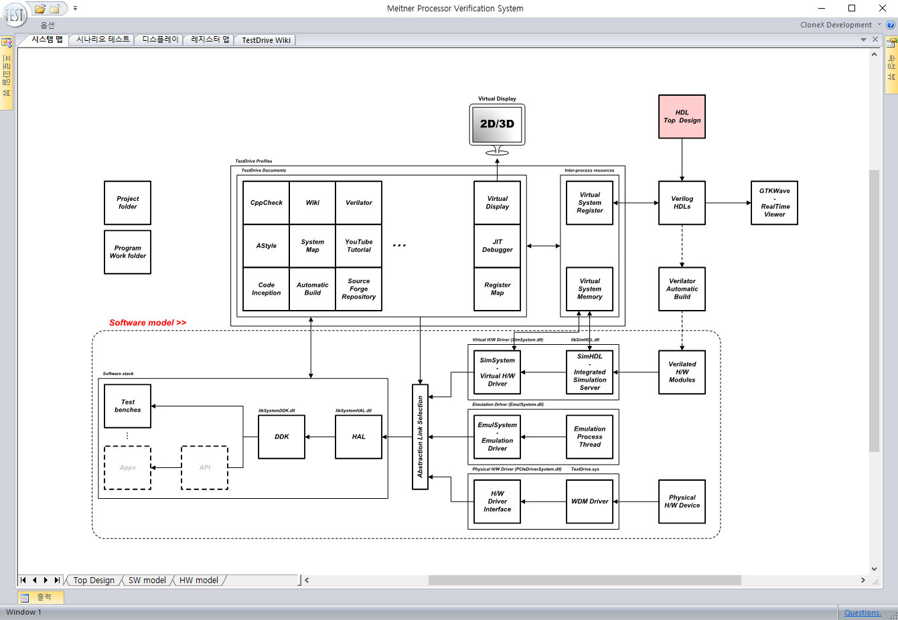

# 도큐먼트 프로파일 설명 : System map

| | |
| :------------: | ------------ |
| **Name**  | System Map / Mapa del sistema / 시스템 맵 / システムマップ |
| **Path**  | %TESTDRIVE_PROFILE%/Common/SystemMap  |
| **Language**  | English / español / 한국어 / 日本語  |
| **Profile View** | System/System map  |



 
시스템 맵은 내부적으로 Microsoft Office 의 Visio 를 사용하기 때문에 이것이 사용하고자 하는 PC에 설치되어 있어야 합니다.
설치되지 않을 경우 아래와 같은 경고가 표시됩니다.

경고 : '시스템 맵' 도큐먼트를 구동하기 위해서는, 마이크로소프트의 Visio 뷰어 64bit(무료버전)의 설치가 필요합니다.

Microsoft 웹페이지에서 Visio viewer 64bit용 (무료버전)을 다운받을 수 있습니다.
TestDrive 가 현재 64bit 프로그램이기 때문에 동일한 64bit 버전이 설치되어 있어야 합니다.
32bit 용 Visio 가 설치되어 있어도 위와 같은 경고 메시지를 보시게 됩니다.

예제에서 Meitner/Profiles/Config.ini 를 수정합니다.
```ini
[System Map]
FILE = "%PROJECT%Documents\SystemMap\SystemMap.vsd"
```
위는 현재 프로젝트의 Documents/SystemMap/SystemMap.vsd 파일을 참조하여 위와 같이 시스템 맵을 보여주고 있습니다.
 
편집을 하려 할 때에는 언제든 오른쪽 버튼을 눌러 Visio 를 통해 가능합니다.

 
Visio 의 기본 기능인 특정한 드로우 객체를 클릭하였을 때 HyperLink 를 설정하는 것으로 언제든 다른 페이지로 이동이 가능하지만,

그외에 HyperLink의 주소에 아래와 같이 TestDrive 에서만 가능한 별도의 기능이 추가되어 있습니다.

1. 프로파일 실행.
    `http://profile?프로파일_경로`
    예) `http://profile?%PROJECT%Profiles\common\view_system_memory.sp`
2. Text 편집기 호출
    `http://edit?파일명`
    또는
    `http://edit?파일명?검색단어`
    예) `http://edit?%PROJECT%System/HDL/top/testdrive_axi4_lite_bfm.sv?SAXIW_Interface`
3. Visio 파일 변경
    `http://visio?파일명`
    예) `http://visio?%PROJECT%Document/co-processor.vsd`
4. 쉘 실행 (cmd 창으로 표시됨.)
    `http://shell?파일명`
    `http://shell?파일명?파라미터`
    `http://shell?파일명?파라미터?실행위치`
    예) `http://shell?`
5. 파일 실행 : (출력창에 표시됨.)
    `http://execute?파일명`
    `http://execute?파일명?파라미터`
    `http://execute?파일명?파라미터?실행위치`
    예) `http://execute?`

> 현재 OpenOffice 나 LibreOffice 의 Draw 의 성능과 편의성이 상용 프로그램인 Visio 보다 더 좋아지기를 기다리고 있으며, 가능한 상용프로그램을 사용하지 않기 위해 Draw 가 Visio 보다 개선되는 시점에서 향후 변경될 가능성이 있습니다.

### [:fa-arrow-left: Back](?top.md)
