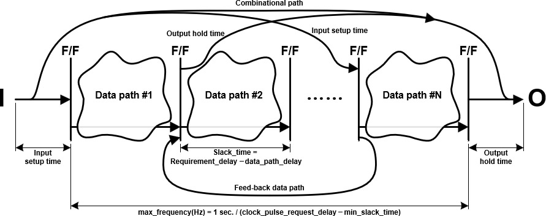

# Document Profile : Xilinx Synthesis

| | |
| ------------: | ------------ |
| **Name**  | Xilinx Synthesis / Xilinx Síntesis / 자일링스 합성 / ザイリンクス合成 |
| **Path**  | %TESTDRIVE_PROFILE%/Common/XilinxSynthesis  |
| **Language**  | English / español / 한국어 / 日本語  |
| **Profile View** | System :fa-angle-right: Analysis :fa-angle-right: Xilinx Synthesis  |

HDL 을 FPGA 용으로 빌드하고 동작속도, Setup/Hold 시간, 조합 딜레이, Registers / LUTs / BRAMs 사용량을 측정하고,
이전에 빌드한 결과를 파일별로 비교할 수 있습니다.

Xilinx 의 Vivado 가 설치 되어야 합니다. (ISE 는 더이상 지원하지 않습니다.)
여기에서 Xilinx 라이센스 획득에 대해서는 별도로 언급하지 않습니다.
(참조 : [Vivado 다운로드](https://www.xilinx.com/support/download.html "Vivado 다운로드"))

`%PROJECT%Profiles/Config.ini` 파일의 설정부터 시작한다.

[Xilinx Synthesis]
PROJECT_PATH = %PROJECT%System\HDL\DUTs

"Xilinx Synthesis" 색션의 PROJECT_PATH 지정된 경로가 합성을 수행하는 프로젝트 디렉토리가 됩니다.
이 폴더를 포함한 모든 하위 폴더에서 verilog 소스를 검색하여 리스트를 만들게 됩니다.
프로젝트 디렉토리에는 아래의 자일링스 합성에 대한 설정 환경이 ".XilinxSynthesis" 파일로 저장되고,
각 개별 파일을 합성할 때 필요한 추가 소스들은 ".XilinxSynthesis.sources" 에 나열합니다.
폴더 내에 verilog 소스가 없거나 ".TestDrive.nosearch" 또는 ".XilinxSynthesis.nosearch" 파일이 검색되면 해당 폴더는 리스트에
추가하지 않습니다. (Meitner 의 %PROJECT%System/HDL/DUTs/top_template)
검색되는 확장자는 VHDL(.vhd), verilog(.v) 와 system verilog(.sv) 만 해당되며,
개별 파일이 검색되지 않기 위해서는 entity(VHDL), module(verilog/system verilog) 선언 이전에
`/* HIDDEN */` 와 같이 주석이 삽입되면 검색이 되지 않습니다.

.XilinxSynthesis.sources 추가할 수 있는 소스는 .v, .xdc(vivado only) 를 사용할 수 있으며, * (wildcard) 문자를 사용하여
여러 소스를 한번에 추가할 수 있습니다. include path 는 %PROJECT%System\HDL 가 기본적으로 포함되어 있으며,
추가적으로 include path를 지정하려면 '@'로 시작되어야 하며, TCL 명령어를 사용할 경우
'#' 으로 시작되어야 합니다. '//' 와 ';' 는 주석의 시작을 나타냅니다.
빌드하는 시점의 소스의 경로에서 '.XilinxSynthesis.sources' 를 찾으며 파일이 없을 경우
프로젝트 디렉토리까지 해당하는 단계별 하위 폴더로 내려가 순서대로 찾아 소스를 적용시킵니다.

검색 예시) %PROJECT%System\HDL\DUTs\A\B\C\top.v 를 빌드할 경우 아래 순서대로 찾습니다.
(프로젝트 폴더 : `%PROJECT%System\HDL\DUTs` 지정)
          1. %PROJECT%System\HDL\DUTs\A\B\C\.XilinxSynthesis.sources
          2. %PROJECT%System\HDL\DUTs\A\B\.XilinxSynthesis.sources
          3. %PROJECT%System\HDL\DUTs\A\.XilinxSynthesis.sources
          4. %PROJECT%System\HDL\DUTs\.XilinxSynthesis.sources

사용 예시) .XilinxSynthesis.sources
// 이곳에 Synthesis에 필요한 HDL 소스 리스트를 추가합니다.
// 포함경로 추가 (경로는 프로젝트의 경로로 부터 상대주소입니다.)
@processor_axi_wrapper
// 소스 추가 (경로는 프로젝트의 경로로 부터 상대주소입니다.)
`../library/*.v`
`processor_axi_wrapper/*.v`

// TCL 명령어 추가
`#set_property verilog_define TEST_DESIGN [current_fileset]`

## 1. 속성 뷰

속성 뷰에서는 아래와 같이 나열되어 있으며, 각 속성에 대한 설명은 다음과 같습니다.

### 1) 경로 필터

검색된 H/W 소스들을 지정한 경로에 제한하여 보일 수 있습니다.

### 2) 자일링스 설치 경로

도큐먼트 실행시 각 드라이브에서 "Xilinx" 폴더 존재 여부를 검색하여,
자일링스 설치 경로를 지정합니다.
못 찾을 경우 개발자가 직접 입력해 줘야 하며, 찾을 경우 아래와 같이
출력 창에 메시지를 보이게 됩니다.

설치된 자일링스(Vivado 2015.4) 경로를 찾았습니다. (경로 : D:\Xilinx\Vivado\2015.4\)

### 3) 프로젝트 경로

%PROJECT%Profiles/Config.ini 에 지정된 "Xilinx Synthesis" 섹션에서 얻은 경로를
기본 경로로 지정합니다. 직접 변경이 가능합니다.

### 4) 페밀리

자일링스 디바이스 페밀리를 지정합니다.
리스트에 대부분 추가하였지만, 사용자가 직접 입력 가능합니다.

 
위와 같이 리스트를 미리 작성하였으나, 리스트에 존재하지 않는 새로운 디바이스의 경우
직접 입력하여야 합니다.
(존재하지 않는 디바이스가 있다면, 알려주시기 바랍니다.)

### 5) 디바이스

자일링스 디바이스 이름을 지정합니다.

### 6) 패키지

자일링스 디바이스에 해당하는 패키지 종류를 지정합니다.

### 7) 스피드

자일링스 디바이스의 동작 스피드 레이트를 지정합니다.

### 8) 목표 속도 (MHz)

합성의 목표 속도(MHz) 를 지정합니다.
타겟 클럭 Constraint 를 주는데 사용됩니다.

### 9) 클럭 신호

목표 속도를 지정할 클럭 신호를 나열합니다.

### 10) 리셋 신호

리셋 신호를 지정합니다.
지정한 리셋 신호는 TIG(Timing Ignore) 속성의 constraint 를 가집니다.
 
### 11) 최대 경로 수

합성 리포트에 나열할 Critical path 의 최대 경로 개수를 지정합니다.
1~100 의 범위를 가질 수 있습니다..

## 2. H/W 타이밍 설명

결과 테이블의 내용 이해를 돕기, 위해 먼저 H/W 타이밍에 대하여 간략하게 설명합니다.
보통 하나의 IP 에 아래와 같은 타이밍을 도출할 수 있습니다.

* **Combinational delay time**
> 입력 pin 에서 출력 pin 까지 별도의 클럭에 의해 레지스터에 저장되지 않고, wired logic gate 들만으로 일렬로 연결된 경로의 최대 소요 시간을 말합니다. 
* **Input setup time**
> 입력에서 pin 에서 clock 에 의해 최초 레지스터에 저장되기까지의 최대 소요 시간을 말합니다.
* **Output hold time**
> clock 에 의해 저장된 레지스터에서 출력 pin 까지의 최대 소요 시간을 말합니다.
* **Slack time**
> 인접한 레지스터 간에 걸린 시간을 요구시간(Requirement delay : 1/clock 동작속도)에 뺀 나머지 시간을 말합니다. 이 값이 음수라면 clock 동작 시간보다 오래 걸린다는 의미이기 때문에, 요구하는 동작속도를 정상적으로 맞추지 못할 수 있습니다.

이 때 combinational delay time 이 존재할 경우 다른 IP 와 연결시 새로운 setup/hold time 이 될 수 있으며, setup/hold time 이 요구하는 동작속도를 넘어설 경우에는 측정된 Slack time 이 다른 IP 와 연결시 증가된 새로운 Slack time 이 생성되어 동작속도를 낮추는 원인이 됩니다. 때문에 가능한 낮은 Setup/Hold time 과 가능한 Combinational path 를 제거한 디자인을 갖추는 것이 좋은 디자인이라 할 수 있습니다.
Slack time 은 요구되는 클럭의 딜레이 시간에 대한 상대적 여유 시간이므로, 최대 동작 속도를 다음과 같이 계산할 수 있습니다.

$$estimated_maximum_operation_speed(Hz) = \frac{1sec}{(requirement_delay - slack_time)}$$

다만 multicycle path('N') 의 경우 requirement delay 가 N 배수만큼 증가 되어 반영됩니다. 때문에 이경우는 다음과 같이 동작속도가 결정됩니다.

$$estimated_maximum_operation_speed(Hz) = \frac{1sec}{(requirement_delay - slack_time)} \times Multicycle_count$$

## 3. 테이블 설명

 
테이블에 표시되는 각각의 의미는 다음과 같습니다.

#### 1) 합성 대상

합성 대상이 되는 폴더(회색 음역)나 대상 verilog 파일 이름을 나타냅니다.
대상 파일을 클릭하면 해당 파일의 합성이 진행됩니다.
폴더를 클릭할 경우 해당 폴더에 속하는 하위 대상 파일들이 모두 합성됩니다.
폴더에서 ".XilinxSynthesis.nosearch" 파일이 검색되면 해당 폴더의 검색은 무효가 됩니다.

합성 대상 폴더 앞의 "폴더 아이콘" 해당 폴더를 바로 열람 가능하게 하며 나머지 아이콘들을
클릭하면 아래와 같은 기능을 수행합니다.

* 현재 결과를 기준 값으로 지정하기.
	현재 합성 결과를 기준 값으로 저장합니다.
	이 기준값은 소스 변경 후 다시 합성할 때 비교 대상이 되어,
	차이가 있을 경우 얼마나 개선이 되었는지 상대적 수치로 표시됩니다.

* 소스 보기
	해당 verilog 소스를 직접 수정 할 수 있도록 열람합니다.

* 자일링스 리포트 상세 보기
	합성이 되었을 때 한눈에 볼 수 있도록 요약하여 보여주지만,
	자일링스가 제공하는 대상 파일의 보다 상세한 정보를 아래와 같이 열람하도록 합니다.

>자일링스 합성은 지정된 프로젝트 폴더에 ".XilinxSynthesis.work" 이름의 폴더를 생성 후 합성이 진행됩니다.
	이 폴더를 지울 경우 자일링스 리포트를 볼 수 없게 됩니다.

#### 2) 동작속도

현재 파일의 최대 동작 주파수를 계산합니다.
클럭 동기가 있을 경우 정상적인 MHz 표시를 하지만,
조합 딜레이 (Combination logic delay) 만 존재할 경우.
회색으로 조합 딜레이 시간으로 최대 동작 주파수를 추정 계산하여 알려줍니다.
이 수치는 Setup/Hold 시간이 제외된 순수한 F/F 간의 걸리는
시간으로 구한 동작 속도입니다.

음영 표시된 폴더에는 폴더 내의 가장 느린 동작속도를 보이게 됩니다.
디자인이 정상적으로 동작하기 위해서는 여기의 동작 속도보다
낮은 속도로 클럭을 사용하여야 합니다.

클럭계산을 아래와 같은 수식으로 계산됩니다.

클럭(MHz) = 1000 / (clock_required_latency - slack_latency)

#### 3) Setup/Hold 시간

클럭과 동기되는 F/F 간의 걸리는 동작 시간 이외에
다자인 상의 입력 포트와 처음 만나는 F/F 까지 걸리는 시간과, 
맨 마지막 F/F 과 출력 포트까지의 진행에 필요한 시간을 
각각 Setup 시간, Hold 시간으로 정의합니다.

이 시간은 F/F 간의 걸리는 시간(동작속도)이 존재할 때,
이것 대비 차지하는 시간을 % 로 환산하여 같이 출력합니다.
%가 100에 가까울 수록 Setup/Hold 시간이 동작속도와 동일하다는
뜻으로 점점 붉게 표시되며, 100을 넘어서면 어떠한 디자인에 붙더라도
"2. 동작속도" 수치로 동작 불가능하게 되므로 잘못된 디자인 설계가 됩니다.

#### 4) 조합 딜레이

클럭과 동기되지 않는 입력과 출력간의 조합 회로 (Combinational logic) 의
동작에 필요한 시간이 됩니다. 이 값도 "2. 동작속도"가 존재할 경우
해당 대비 차지하는 %를 같이 표시됩니다.
항상 100보다 낮은 수치가 되도록 유지되어야 표시된 동작속도를
만족할 수 있는 디자인이 됩니다.

#### 5) Registers

지정한 FPGA 에서 사용한 F/F 라인 개수를 나타냅니다.
총 사용량을 전체 개수 대비 % 비율로 같이 표시됩니다.

#### 6) LUTs

FSM 이나 조합 로직의 경우 LUT 를 소모하게 됩니다.
총 사용량을 전체 개수 대비 % 비율로 같이 표시됩니다.

#### 7) B/URAMs

SRAM 의 설계가 들어있을 때, Block/Ultra RAM을 소모하게 됩니다. 
FPGA 상의 BRAMs 의 개수는 매우 제한되어 있으므로 사용에 유의하여야 합니다.

BRAMs 의 최대 사용량을 넘어설 경우 LUT 또는 Register 메모리를
소모하게 되는데, 합성 시간도 오래걸릴 뿐 아니라  소모량이 매우 크기 때문에
가능한 최대 개수를 넘지 않도록 주의하여야 합니다.

또한 가용한 SRAM 수가 충분하더라도 설계된 SRAM 의 크기가
매우 작거나 또는 매우 크다고 판단될 경우에도 LUT 메모리로 대체 소모됩니다.
이때에서는 Synthesis 옵션을 변경하거나 설계한 SRAM 디자인을 변경할
필요가 있습니다.

가능한 `%PROJECT%System/HDL/library/` 에 포함되어 있는
`SRAM_*.v` 디자인을 참고하여 사용하기를 추천합니다.

총 사용량을 전체 개수 대비 % 비율로 같이 표시됩니다.

#### 8) DSPs

설계에 곱셈과 같은 연산기를 사용할 때 DSPs 를 소모모하게 됩니다.
FPGA 상의 제한된 DSPs 수 이상을 사용하게 되면,
설계한 디자인이 급격하게 성능이 하락하게 됩니다.

총 사용량을 전체 개수 대비 % 비율로 같이 표시됩니다.

[타이밍 설명]
 
>테이블에서 나타내는 '동작속도', 'Setup/Hold 시간', '조합 딜레이' 는 위의 그림과 비교해 다음과 같이 설명됩니다.
'동작속도' = 1초 / (F/F 간의 사이의 최대 시간) , (발현조건 : Input port 에서 Output port 사이에 적어도 연결된 F/F 가 2단 이상 존재하여야 한다.)
'Setup 시간' = Input port 에서 처음 F/F 까지 걸리는 시간. (발현조건 : Input port 에서 Output port 사이에 적어도 연결된 F/F 가 1단 이상 존재하여야 한다.)
'Hold 시간' = 마지막 F/F 에서 Output port 까지 걸리는 시간. (발현조건 : Input port 에서 Output port 사이에 적어도 연결된 F/F 가 1단 이상 존재하여야 한다.)
'조합 딜레이' = Input port 에서 Output port 까지 F/F 를 통과하지 않는 회로의 최대 걸리는 시간. (발현조건 : Input port 에서 Output port 사이에 F/F 가 존재하지 않는 경로가 존재하여야 한다.)

여기서 동작속도는 F/F 간 사이에 걸리는 최대 시간에 의한 동작 가능한 최대 Hz 수치이기 때문에
'Setup 시간' 과 'Hold 시간' 그리고 '조합 딜레이'는 이 동작 속도를 제약하지 않는 범위의 수치로 작아야 하며,
특히 '조합 딜레이는' 다른 모듈과 연결할 때, 해당 모듈의 'Setup/Hold 시간' 에 악영향을 미치므로 가능한 없어야 합니다.

### [:fa-arrow-left: Back](?top.md)
