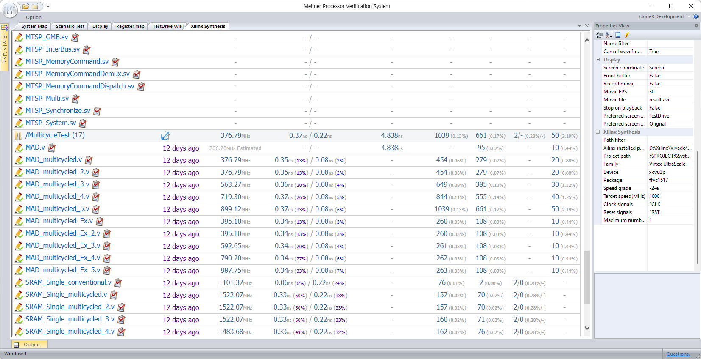
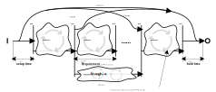
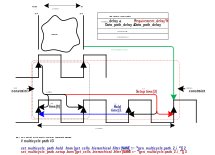

# Document Profile : Xilinx Synthesis

| | |
| ------------: | ------------ |
| **Name**  | Xilinx Synthesis / Xilinx Síntesis / 자일링스 합성 / ザイリンクス合成 |
| **Path**  | %TESTDRIVE_PROFILE%/Common/XilinxSynthesis  |
| **Language**  | English / español / 한국어 / 日本語  |
| **Profile View** | System :fa-angle-right: Analysis :fa-angle-right: Xilinx Synthesis  |



You can build HDL for Xilinx FPGA, measure operation speed, setup/hold time, combination delay, Registers / LUTs / BRAMs usage, and compare the results of previous builds by file.

Xilinx's Vivado must be installed.
No separate mention is made here of obtaining a Xilinx license.
(Refer. : [Vivado download page](https://www.xilinx.com/support/download.html))

Start with the settings in the `%PROJECT%Profiles/Config.ini` file.

[Xilinx Synthesis]
PROJECT_PATH = %PROJECT%System\HDL\DUTs

The path specified in `PROJECT_PATH` in the "Xilinx Synthesis" section becomes
the project directory where synthesis is performed.
Verilog sources will be searched in all subfolders including this folder to create a list.

In the project directory, the setup environment for the Xilinx synthesis below is saved as
a ".XilinxSynthesis" file, and additional sources required when synthesizing
each individual file are listed in ".XilinxSynthesis.sources".

If there is no verilog source in the folder or
a ".TestDrive.nosearch" or ".XilinxSynthesis.nosearch" file is searched,
the folder is not added to the list. (Meitner project's %PROJECT%System/HDL/DUTs/top_template)

The extensions searched are only VHDL(.vhd), verilog(.v) and system verilog(.sv).
In order for individual files not to be searched, before declaring entity (VHDL) or
module (verilog/system verilog)
If comments such as `/* HIDDEN */` are inserted on source file, the search will not work.

.XilinxSynthesis.sources Sources that can be added include .v and .xdc,
and can be added using the * (wildcard) character.
You can add multiple sources at once.
The include path includes %PROJECT%System\HDL by default.
To specify an additional include path,
it must start with '@', and when using TCL commands,
it must start with '#'. '//' and ';' indicates the beginning of a comment.

Search for '.XilinxSynthesis.sources' in the source path at the time of building.
If the file is not found, go down to the project directory and
search for each step's subfolder in order to apply the source.

Search sequence example.) When building `%PROJECT%System\HDL\DUTs\A\B\C\top.v`, it looks in the order below.
(Project folder : when `%PROJECT%System\HDL\DUTs` is specified.)
          1. %PROJECT%System\HDL\DUTs\A\B\C\.XilinxSynthesis.sources
          2. %PROJECT%System\HDL\DUTs\A\B\.XilinxSynthesis.sources
          3. %PROJECT%System\HDL\DUTs\A\.XilinxSynthesis.sources
          4. %PROJECT%System\HDL\DUTs\.XilinxSynthesis.sources

Usage example.) .XilinxSynthesis.sources
```cpp
// Add the HDL source list required for Synthesis.
// Add inclusion path (relative address from the project path.)
@processor_axi_wrapper
// Source addition (relative path from the project path.)
../library/*.v
processor_axi_wrapper/*.v
// add TCL command
#set_property verilog_define TEST_DESIGN [current_fileset]
```

## 1. Properties

In the property view, they are listed as follows, and a description of each property is as follows.

### 1) Path filter

Searched H/W sources can be displayed limited to the specified path.

### 2) Xilinx installed path

When running the document, each drive is searched for the existence of the "Xilinx" folder and the Xilinx installation path is specified.
If it cannot be found, the developer must enter it directly. If it is found, a message will be displayed in the output window as shown below.

```tcl
Installed Vivado Path : D:\Xilinx\Vivado\2023.2\
Installed Vivado version : 2023.2
```

### 3) Project path

Path obtained from the "Xilinx Synthesis" section specified in %PROJECT%Profiles/Config.ini
Specify it as the default path. You can change it yourself.

### 4) Family

Specifies the Xilinx device family.
Most of them have been added to the list, but users can enter them directly.
These lists are automatically updated when vivado is installed.

### 5) Device

Specifies the Xilinx device name.

### 6) Package

Specifies the package type corresponding to the Xilinx device.

### 7) Speed grade

Specifies the operating speed rate of the Xilinx device.

### 8) Target speed (MHz)

Specifies the target speed (MHz) for synthesis.
Used to provide target clock constraint.

### 9) Clock signals

Lists the clock signals for which to specify the target speed.

### 10) Reset signals

Specifies the reset signal.
The specified reset signal has the constraint of the TIG (Timing Ignore) property.
 
### 11) Maximum number of paths

Specifies the maximum number of critical paths to list in the composite report.
It can range from 1 to 100.


## 2. H/W timing explanation

<p align="center">
  
</p>

To help you understand the contents of the result table, we will first briefly explain H/W timing.
Usually, the timing below can be derived for one IP.

* **Combinational delay time**
> This refers to the maximum time required for a path connected in series with only wired logic gates, without being stored in a register by a separate clock from the input pin to the output pin.
* **Input setup time**
> This refers to the maximum time required from the input pin to being stored in the first register by the clock.
* **Output hold time**
> This refers to the maximum time taken from the register saved by clock to the output pin.
* **Slack time**
> This refers to the time remaining after subtracting the time taken between adjacent registers from the requirement time (Requirement delay: 1/clock operation speed). If this value is negative, it means that it takes longer than the clock operation time, so the required operation speed may not be achieved properly.
* **Multicycle path**
> There is no way to distinguish between multicycle path and 1 cycle path in HDL.
So seperated special constraint settings are required.
Nevertheless, the reason for using the multicycle path is that
it has the advantage of easily improving clock speed without consuming F/F and HDL modification.
In a general way, high clock speeds can be achieved by dividing a very large combinational path 
into smaller data paths through multiple F/F slices.
However, it is very difficult to design HDL by dividing to more smaller design
into uniform time intervals.
<p align="center"></p>
First, 1 cycle path refers to the path between F/F where the hold time is 0 and the setup time is 1.
To put it more simply, it means that it receives input from the 0th clock and outputs from the 1st clock.
If the input is received from the 0th clock and the output is taken from the Nth clock that
is greater than 1, a higher clock can be used.
For example, if you specify a constraint that receives input from the 0th clock and output from the 3rd clock,
The setup time must be 3.
However, the hold time is counted in the opposite direction from the second clock just before the 3rd clock.
So hold time should be 2.
In other words, the multicycle path designation of N cycle latencies has N setup time and (N-1) hold time.
Lastly, using a multicycle path means maintaining the same value as the input clock latency, 
so TCL scripts must use `set_multicycle_path ~[hold/setup]~ from ~ [cells]` as shown above.

At this time, if combinational delay time exists, a new setup/hold time may be created when connecting to another HDL design. If the setup/hold time exceeds the required operation speed, the measured slack time may be increased when connecting to another HDL design. Slack time is created, which causes the operation speed to slow down. Therefore, it can be said that a good design is to have a design that has as low a setup/hold time as possible and eliminates combination paths as much as possible.
Slack time is a relative slack time to the required clock delay time, so the maximum operating speed can be calculated as follows.

$$Estimated\,maximum\,operation\,speed(\mathrm{Hz}) = \frac{1\mathrm{sec}}{(requirement\,delay - slack\,time)}$$

However, in the case of multicycle path('N'), the requirement delay is reflected by increasing it by a multiple of N. Therefore, in this case, the operation speed is determined as follows.

$$Estimated\,maximum\,operation\,speed(\mathrm{Hz}) = \frac{1\mathrm{sec}}{(requirement\,delay - slack\,time)} \times multicycle\,count$$

## 3. Table contents explanation

The meaning of each item in the table is as follows.

#### 1) Synthesis target

Indicates the folder (gray transliteration) or target verilog file name for synthesis.
When you click on a target file, compositing of that file will proceed.
When you click on a folder, all sub-target files belonging to that folder are synthesized.
If a ".XilinxSynthesis.nosearch" file is searched in a folder, the search in that folder will be invalid.

The "folder icon" in front of the synthesis destination folder allows you to view the folder immediately, 
and clicking on the remaining icons performs the following functions.

* Specify the current result as the reference value.
	Saves the current synthesis result as the reference value.
	This standard value is used for comparison when recombining after changing the source, 
	and if there is a difference, the amount of improvement is displayed as a relative value.

* View source
	View the verilog source so that you can modify it directly.

* View detailed Xilinx report
	When synthesized, it is summarized so that you can see it at a glance,
	but you can view more detailed information about the target file provided by Xilinx as follows.


> Xilinx synthesis is performed after creating a folder named ".XilinxSynthesis.work" in the designated project folder.
	If you delete this folder, you will no longer be able to view Xilinx reports.

#### 2) Timing

Calculates the maximum operating frequency of the current HDL file.
If there is clock synchronization, 
normal MHz is displayed, but if only combination logic delay exists, 
the maximum operating frequency is estimated and calculated using the combination delay time in gray.

This figure is the operating speed obtained by pure F/F timing, excluding Setup/Hold time.

Shaded folders show the slowest operating speed within the folder.
In order for the design to operate properly, 
the clock must be used at a lower speed than the operating speed here.

The clock is calculated using the formula below.

Clock(MHz) = 1000 / (clock_required_latency - slack_latency)

#### 3) Setup/Hold time

In addition to the operation time between F/Fs synchronized with the clock,
the time required to reach the first F/F with the input port on the design, 
and the time required to proceed to the last F/F and output port 
are defined as setup time and hold time, respectively.

When there is a time (operation speed) between F/F, 
this time is converted into % and output together with the time taken compared to this.

The closer the % is to 100, the more red it appears, 
meaning that the Setup/Hold time is the same as the operation speed. 
If it exceeds 100, no matter what design it is attached to, 
it will not be able to operate due to the "2) Timing" value, 
resulting in an incorrect design.

#### 4) Combinational delay

This is the time required for the operation of a combination logic between
input and output that is not synchronized with the clock.
If "2) timing" value exists, this value is also displayed as a percentage of that value.
The design must always be kept lower than 100% to satisfy the indicated operating speed.

#### 5) Registers

Indicates the number of F/F lines used in the specified FPGA.
The total usage is displayed as a percentage of the total number.

#### 6) LUTs

In the case of FSM or combination logic, LUT is consumed.
The total usage is displayed as a percentage of the total number.

#### 7) B/URAMs

When SRAM design is included, Block/Ultra RAM is consumed. 
The number of BRAMs on an FPGA is very limited, so care must be taken when using them.

If the maximum usage of BRAMs is exceeded, 
LUT or Register memory will be consumed. 
Not only does the synthesis time take a long time, 
but the consumption is also very large, 
so care must be taken not to exceed the maximum possible number.

In addition, even if the number of available SRAMs is sufficient, 
if the size of the designed SRAM is judged to be very small or very large, 
it is replaced with LUT memory.
In this case, it may be necessary to change the Synthesis option or change the designed SRAM design.

It is recommended that you refer to the `SRAM_*.v` design 
included in `%PROJECT%System/HDL/library/` whenever possible.

The total usage is displayed as a percentage of the total number.


#### 8) DSPs

When you use operations such as multiplication in your design, you consume DSPs.
If you use more than the limited number of DSPs on the FPGA, 
your design's operation speed will rapidly degrade in performance.

The total usage is displayed as a percentage of the total number.

[Timing Description]
 
>The 'operation speed', 'Setup/Hold time', and 'combination delay' shown in the table are explained as follows compared to the picture above.
'Operation speed' = 1 second / (maximum time between F/F) , (Expression condition: There must be at least 2 F/Fs connected between the input port and the output port.)
'Setup time' = Time taken from input port to first F/F. (Expression condition: There must be at least one F/F connected between the input port and the output port.)
'Hold time' = Time taken from the last F/F to the output port. (Expression condition: There must be at least one F/F connected between the input port and the output port.)
'Combination delay' = maximum time taken for a circuit that does not pass through F/F from the input port to the output port. (Expression condition: There must be a path without F/F between the input port and the output port.)


Here, the operating speed is the maximum Hz value
that can be operated based on the maximum time taken between F/F,
so the 'Setup time', 'Hold time', and 'Combination delay' 
must be small and within a range that does not restrict this operating speed.
In particular, 'combined delay' should be avoided as much as possible as 
it has a negative effect on the 'Setup/Hold time' of 
the module when connected to other modules.


### [:fa-arrow-left: Back](?top.md)
