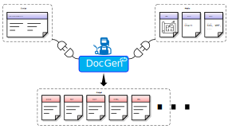

# Tutorial : DocGen(Document Generator) Project

<p align="center">
  
</p>

docgen is a tool that refers to a template WORD (.docx) file and creates a new WORD (.docx) and various documents such as PDF/HTML/DjVu through Markdown + HTML + Lua script.
> :fa-send-o:Tip : To use all of docgen's features, additional installation of Microsoft's WORD, Excel/Visio(optional), draw.io(automatic install) and Draw(LibreOffice) is required. This manual below was also produced by DocGen.

To write appropriate content, please see the more detailed manual below.

* [한국어 메뉴얼](../download/docgen_userguide_ko.pdf)
* [English manual](../download/docgen_userguide_en.pdf)


## 1. Simplified project example
#### Quick approach) "Project creation :fa-arrow-right: build" series of an example
```bash
C:\Project> create_project docgen_simplified TestDoc
*I: Create DocGen simplified project : 'TestDoc'
Run 'build.bat' to build document.

C:\Project> cd TestDoc

C:\Project\TestDoc> ls
build.bat  main.md  media

C:\Project\TestDoc> docgen main.md
1. Introduction
   Main functions
2. first Contents
   media contents
*I: Link all bookmarks.
*I: Build document : Header_Name_userguide_rev1.0.docx
*I: Fields calculation & Saving to PDF output : Header_Name_userguide_rev1.0.pdf

C:\Project\TestDoc> Header_Name_userguide_rev1.0.pdf
```
Modify main.md as you want. And run '**docgen main.md**' again.

## 2. Pre-organized project example with sharing document template
#### Quick approach) "Project creation :fa-arrow-right: build" series of an example
```bash
C:\Project> create_project docgen TestDoc
*I: Create DocGen project : 'TestDoc'
Run 'make' to build document.

C:\Project> cd TestDoc

C:\Project\TestDoc> ls
Makefile  main.lua  media  src  template

C:\Project\TestDoc> make
*** DocGen Build *** (Please wait a seconds!!!)
1. Introduction
   Main functions
2. first Contents
*I: Link all bookmarks.
*I: Build document : TestDoc_userguide.docx
*I: Fields calculation & Saving to PDF output : TestDoc_userguide.pdf

C:\Project\TestDoc> TestDoc_userguide.pdf
```

### (1) Project creation
Create a project ('Project_Name') by entering a command in the command window as shown below.
```bash
create_project docgen [Project_Name]
```
At this moment, The default project will be created with the specified 'Project_Name' name.

### (2) File list

| Files | Description |
| ------------ | ------------ |
| Makefile  | Build script for 'make' command |
| main.lua  | set-up document properties & chapter markdown files. |
| template/docgen_template.docx  | Microsoft WORD's template document. (**You must modify the template document.**)|
| src/*.md | Example markdown files |
| media/* | Example image/excel/visio files  |

### (3) Build
Below codes are the 'main.lua' example of the created project.
(_You should edit the contents below as you want._)
```lua
-- Document properties
property["Document_Name"]           = "UserGuide"
property["IP_Version"]              = "1.00"
property["Main_Title"]              = "TestDoc"
property["Sub_Title"]               = "(TestDoc Sub Title)"
property["IP_Name_First_Page"]      = "User Guide"
property["IP_Name_Header"]          = "Header Name"
property["Ownership"]               = "someone@mail.com"
property["Document_Name_Header"]    = "userguide"
property["Security_Level"]          = "BSD License."
--property["Water_Mark"]            = "TESTDRIVE OPENSOURCE"		-- If you do not want to use a watermark, comment out this part.

-- Revision history
AddRevision("1.0",	2024,  02,  13,	"Initial relase")

-- Terms
AddTerm("TestDrive", "TestDrive Profiling Master (@<link:https://testdrive-profiling-master.github.io/>)")
AddTerm("Lua", "Lua script language (@<link:https://en.wikipedia.org/wiki/Lua_(programming_language);Wiki>, @<link:http://www.lua.org/;Homepage>)")

-- Chapters
AddParagraph("[[src/Introduction.md]]")
AddParagraph("[[src/Contents.md]]")
```

Build command is `make`.
It makes .docx(WORD) and .pdf files in same folder.

> :fa-send-o:Tip : Docgen manual example : https://github.com/testdrive-profiling-master/profiles/tree/master/Common/doc/docgen


### [:fa-arrow-left: Back](?top.md)
