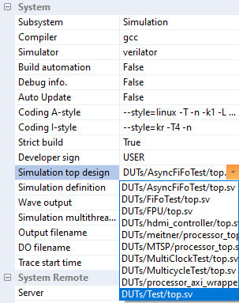

# Tutorial : Verilog Project

#### Quick approach) "프로젝트 생성 :fa-arrow-right: 빌드 :fa-arrow-right: 실행" 일련의 과정 예시
```bash
C:\Project\profiles\Meitner\System\HDL\DUTs>create_project v Test
Done.
C:\Project\profiles\Meitner\System\HDL\DUTs>cd Test

C:\Project\profiles\Meitner\System\HDL\DUTs\Test>.Project.bat
```
> TestDrive 를 재시작 후 `속성 뷰`의 **"시스템/시뮬레이션 탑 디자인"** 에서 생성한 프로젝트를 선택한다.
`프로파일 뷰` 에서 **"System/Build/Build H/W"** 를 실행하여 직접 컴파일하거나,
`속성 뷰`의 **"빌드 자동화"** 를 선택하면 소스 변경시 자동으로 컴파일 된다.

## 1. 프로젝트 생성
verilog 프로젝트는 TestDrive 상의 관리가 필요하므로 특정 폴더에서 생성합니다.
`%PROJECT%System/HDL/DUTs` 위치에서 아래의 명령을 실행하여 프로젝트를 생성합니다.

*(basic Verilog project - for beginer)*
```bash
create_project v [Project_Name]
```
Or
*(bared Verilog project - for expert)*
```bash
create_project v_bare [Project_Name]
```

## 2. 프로젝트 선택 및 빌드
프로젝트 빌드는 TestDrive 를 통해서만 가능하며,
`현재 시뮬레이션`으로 선택과 `빌드` 과정이 필요합니다.
이를 위해서 TestDrive 를 재시작 후, 아래와 같이 선택합니다.


이 때 `빌드 자동화` 도 같이 'True' 로 설정하면 프로젝트의 소스가 수정될 때 같이 컴파일 됩니다.
만약 별도로 빌드하려면 `프로파일 뷰` 에서 **"System/Build/Build H/W"** 를 선택하면 됩니다.

그 외 세부 설정을 보려면 [System Manager Document](?Document_SystemManager.md) 의 '8장 ~ 13장' 을 참조 하시기 바랍니다.

### [:fa-arrow-left: Back](?top.md)
