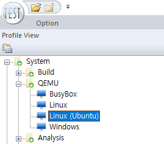
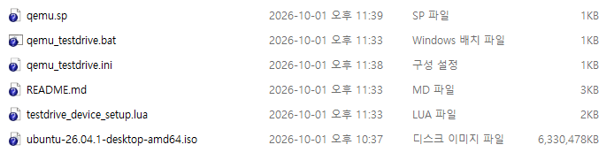
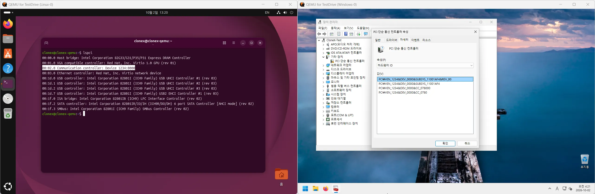
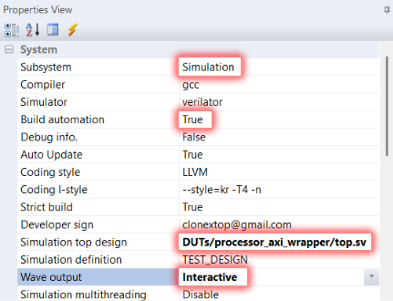
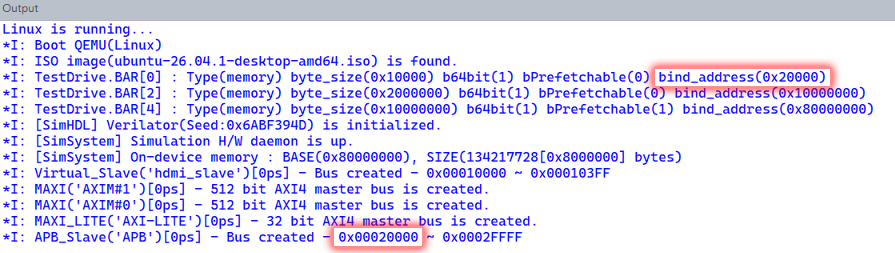
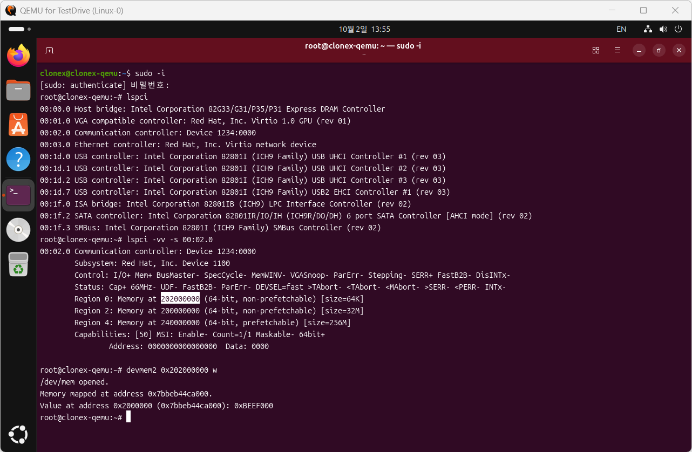
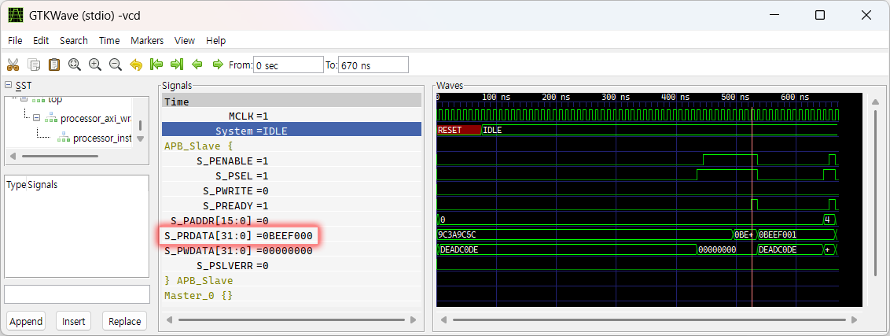

# Tutorial : QEMU(virtual machine) Project

The QEMU project provided by TestDrive Profiling Master treats Verilog HDL as a virtual PCIe device, offering a fully functional simulation environment within a real operating system.

This enables **simultaneous development and testing without the actual hardware**.
* H/W HDL design
* S/W Driver (Windows/Linux)
* Firmware (UEFI)

First at all, you need to enable `hardware virtualization` on CMOS setup. And you must install windows optional feature `Hyper-V`. Type the below command on your Powershell(adminstrator).
```bash
Enable-WindowsOptionalFeature -Online -FeatureName Microsoft-Hyper-V -All
```
And you should run **"System/Build/Build All"** on profile view for ready.

### 1. Create new QEMU project
```bash
>create_project qemu "Linux (Ubuntu)"
*I: Create QEMU project : 'Linux (Ubuntu)'

Run 'QEMU/Linux (Ubuntu)' from profile view on TestDrive Profiling Master.
```
Now restart your TestDrive project, then you can see the new QEMU link on profile view.


### 2. Download .iso OS image to your QEMU project folder
However, to install your preferred operating system, you need the original OS image (an .iso file).
Copy .iso image file to your QEMU project folder, then you can do install new OS on your virtual machine.


Now double click on the profile view link & install OS.
> :fa-send-o:Tip : The initial process of downloading and compiling the QEMU source code takes **approximately 30 minutes**. Additionally, it automatically checks for new updates every week, allowing for a rebuild and re-installation.
> When the virtual machine reboots or shuts down, QEMU may exit or enter a halted state. This is normal behavior; simply restart it after the shutdown the program.

### 3. Installation of preferred OS



Now you can see the your virtual PCIe device on your virtual machine.

### 4. Modify your H/W HDL virtual PCIe device

The project file `qemu_testdrive.ini` contains basic device settings, while more detailed configurations are defined in the Lua script specified by `SETUP_SCRIPT`.
```ini
[TESTDRIVE_DEVICE]
MAIN_VENDOR_ID          = 0x1234
MAIN_DEVICE_ID          = 0x0000
SUB_VENDOR_ID           = 0x0000
SUB_DEVICE_ID           = 0x0000
CLASS_ID                = 0x0780
REVISION                = 0x00
;ROM_FILE               = testdrive_device.rom
SETUP_SCRIPT            = testdrive_device_setup.lua
```
> :fa-send-o:Tip : The `ROM_FILE` setting allows you to specify the UEFI firmware.
> To use the virtual TestDrive device, **you must proceed while the TestDrive project is running.**

The Lua script (`testdrive_device_setup.lua`) allows for the configuration of settings such as BAR and interrupts.

```lua
local dev = TestDriveDevice()

local sProjectPath = String()
local sSubSystemPath = String()
sProjectPath:GetEnvironment("PROJECT")
sSubSystemPath:GetEnvironment("SUB_SYSTEM_PATH")

if sProjectPath:IsEmpty() then
	error("Project is not ready! You must run your TestDrive project first.")
end

do	-- check 'simulation' mode
	local sSubSystemName = String()
	sSubSystemName:GetEnvironment("SUB_SYSTEM_NAME")
	if sSubSystemName.s ~= "Simulation" then
		error("Subsystem must be 'Simulation' mode.")
	end
end

-- set work folder to 'Program' output path
lfs.chdir(sProjectPath.s .. "Program")

-- setup BAR# (type, byte_size, bind_address, 64bit_address, prefetchable)
dev:CreateBAR("memory", 1024*64, 0x20000, true)                     -- BAR #0/1
dev:CreateBAR("memory", 1024*1024*32, 0x10000000, true)             -- BAR #2/3
dev:CreateBAR("memory", 1024*1024*256, 0x80000000, true, true)      -- BAR #4/5

-- setup module implementation
if dev:LoadSystemModule(sSubSystemPath.s) == false then
	os.exit(1)
end

-- setup MSI
dev:EnableMSI(1, false)         -- iVectorCount, bMaskPerVector
--dev:EnableDisplay(640, 480)   -- for VGA device
```

### 5. Quick fully simulation

Let's do test.

##### 1) Simulation H/W setup


Change your TestDrive project's setting at properties View. And do compile H/W.
```ini
Subsystem              = Simulation
Build automation       = True
Simulation top design  = DUTs/processor_axi_wrapper/top.sv
Wave output            = Interactive
```
##### 2) Check PCIe BAR setting

When you run the QEMU, must have same base address with `BAR0` and `APB slave`.
If the addresses do not match, you must modify the `BAR0` setting in the `testdrive_device_setup.lua` file.

##### 3) Try to access your device
Now, run your QEMU project.



Enter the command as shown below.
```bash
> sudo -i
> apt install devmem2             <-- You only need to install devmem2 once.
> lspci -vv -s 00:02.0            <-- This device id is depending on your system.
> devmem2 0x2000000 w             <-- This address is depending on your system.
```

Additionally, you can verify in real-time whether the APB slave bus read value matches the console output value.


> :fa-send-o:Tip : The Linux `devmem2` program has a bug where reading a WORD actually performs a 64-bit operation. Consequently, the actual waveform shows two 32-bit read operations being attempted.

### [:fa-arrow-left: Back](?top.md)
