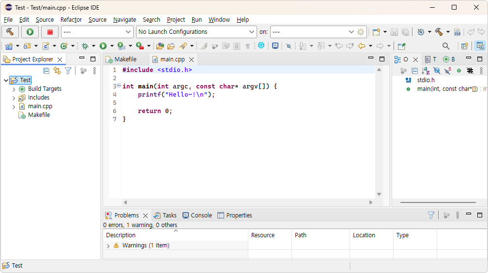

# Tutorial : C/C++ Project

#### Quick approach) "Project creation :fa-arrow-right: build :fa-arrow-right: run" series of an example
```bash
C:\Project>create_project c Test
Done.
C:\Project>cd Test

C:\Project\Test>ls
Makefile  main.cpp

C:\Project\Test>make
- Compiling... : main.cpp

*** Build execution file ***
x86_64-w64-mingw32-g++  -o Test.exe ./main.o   -LC:/Project/profiles/Common/lib -LC:/Project/TestDrive/bin/msys64/usr/lib -lstdc++ -lpthread -lm

C:\Project\Test>ls
Makefile  Test.exe  main.cpp  main.d  main.o

C:\Project\Test>Test.exe
Hello~!
```

## 1. Project creation
Create a project ('Project_Name') by entering a command in the command window as shown below.
```bash
create_project c [Project_Name]
```
At this moment, The default project will be created with the specified 'Project_Name' name.
> :fa-send-o:Tip : By using "create_project util [Project_Name]" instead of "create_project c [Project_Name]", you can use the extended 'util_framework' functionality.

## 2. Build
Below codes are the 'Makefile' of the created project.
```bash
#-------------------------------------------------
# Project
#-------------------------------------------------
SRC_PATH        := .
TARGETPATH      := .
TARGETNAME      := Test

SRCS            := \
	$(wildcard $(SRC_PATH)/*.cpp) \
	$(wildcard $(SRC_PATH)/*.c)
	
INC             := -I.
LIBDIR          :=
CDEFS           :=
EXTRA_CFLAGS    := -O0 -std=c++17 -DDEBUG -g

#-------------------------------------------------
# common document config
#-------------------------------------------------
BUILD_TARGET    = $(TARGET_EXE)
include $(TESTDRIVE_PROFILE)Common/include/config.mk
```
The variable properties specified here are as follows.

| Variable | Description |
| ------------ | ------------ |
| SRC_PATH  | Default source path |
| TARGETPATH  | Result target path |
| TARGETNAME  | Result Target name |
| SRCS | Source list |
| INC | User defined include path list  |
| LIBDIR | User defined library/path list |
| CDEFS | User definition list |
| EXTRA_CFLAGS | Extra definition list (If not specified, default EXTRA_CFLAGS is "-O3 -std=c++17".)  |
| BUILD_TARGET | Build result type<br>- $(TARGET_EXE) : Execution file (.exe)<br>- $(TARGET_SO) : Dynamic library (.so / .dll)<br>- $(TARGET_A) : Static library (.a)<br>- $(TARGET_SO_A) : Dynamic & Static library |
| BUILD_VERSION | set '1' to generate automatic version header.<br>'make version_minor' command will update minor version.<br>'make version_major' command will update major version.  |

Build command is `make`.

## 2. Debugging
For debugging, use the eclipse IDE environment as follows, and execute `.eclipse` in the created project.
```dos
C:\Project\Test>ls -al
total 32
drwxr-xr-x 1 USER None     0 Apr 15 14:41 .
drwxr-xr-x 1 USER None     0 Apr 15 12:32 ..
-rw-r--r-- 1 USER None    53 Apr 15 12:32 .eclipse.bat
-rw-r--r-- 1 USER None 13154 Apr 15 12:32 .cproject
-rw-r--r-- 1 USER None    33 Apr 15 12:32 .inception
-rw-r--r-- 1 USER None  1280 Apr 15 12:32 .project
-rw-r--r-- 1 USER None   530 Apr 15 12:32 Makefile
-rw-r--r-- 1 USER None   103 Apr 15 12:32 main.cpp
```
[Run Screen] 


> :fa-send-o:Tip : It is recommend that you update the index by running the following at first. "Project Explorer :fa-arrow-right: mouse left button :fa-arrow-right: index :fa-arrow-right: Rebuild".

1) Press `CRTL + B` to run the build.
2) Press F5 in "Project Explorer" to confirm that "Test.exe" is added.
3) Press `F11` and select "Local C/C++ Application", switch to Debug mode, and debug.

> :fa-send-o:Tip : After debugging, make sure the program is closed before rebuilding.
 Build results cannot be overwritten without exiting the program.

## 3. Encryption and Decryption on your sources.

If you want to use source encryption/decryption, you must follow the steps below.
* First, add ```SRCS_ENCRYPTED``` variable to your ```Makefile``` as follow.
>```makefile
...
SRCS			:= \
	$(wildcard $(SRC_PATH)/*.cpp) \
	$(wildcard $(SRC_PATH)/*.c)
>
SRCS_ENCRYPTED	:= \
	$(wildcard $(SRC_PATH)/*.encrypted)
...
```
* Create your own encrypted(SHA256+KISA128+α) <u><span style="color:blue">public key file</span></u> on your project folder with '**<i>TestDrive_LM</i>**'.
> **<span style="color:red"><u>DO NOT LOSE</u> THIS PUBLIC KEY CODE. AND <u>DO NOT SHARE</u> THIS WITH UNAUTHORIZED PEOPLE.</span>**
> If you don't, there is no way to decrypt the sources.
```bash
>> TestDrive_LM create [public_key_code]
*I: Done!
    Your public key file is '.TestDrive.public_key'
>
    ** Remember! Do not lose your public key/string!
    ** It is not available to create a private key without a public key/string.
```
> It will create '.TestDrive.public_key' file on your project.
> This file must exist in your project or a higher level folder.
* Do encrypt your source files.
> Encypt sources with command.
```bash
>> make encrypt
>- Encrypting... : main.cpp
Encryption is done!
```
You can find new encrypted files (***.cpp.encrypted**).
```bash
>> ls
Makefile  main.cpp  main.cpp.encrypted
```
And do cleanup original sources.
```bash
>> make distclean
Cleanup is done.
Dist-Cleanup is done.
>
>> ls
Makefile  main.cpp.encrypted
```
All original of encrypted sources will be deleted. Once again <span style="color:red">Do not lose your own public key code</span>.
* Share your project with colleagues.
* Do decrypt the sources
> The colleagues have no original sources.
> So they do decrypt the sources with following command. But they can't.
Because **no private key** is installed their own PC.
```bash
>> make decrypt
>- Decrypting... : main.cpp.encrypted
>*E: No private key. Contact your license manager with following your private hash code.
>
>    - Your private hash : 3F3D714ECE4DA2321B6B747AC42FD08A6F0F4F3CAC2DA7AA59A77483963DE6A3DCDFABA1542D8E8974C2696188B5AF7389088F1FA68CBD60EAC1AFFC901C31D6
>
make: *** [D:/Project/Profiles/Common/include/config.mk;198: main.cpp.decrypted] Error 1
```
They need to install the **'private key'** to decrypt. __Private key has a different value on every single host.__ 
There are two options to install a private key.
First! You can install directly on the host PC.
```bash
>> TestDrive_LM install
>    > Enter Public key   :
>
Your Private key : 21A7421ABCA1B25E005D065D60289823FC082ECE1B24744536DF48EB54CA4CBA
*I: Done.
```
Or if you can't access directly to the host PC, 
you need to get the colleagues' **private hash code**(```3F3D714ECE...```) as can be seen in the decrypt error above.
And then, **generate private key** with on your PC like below.
```bash
>> TestDrive_LM private [public_key_code]  3F3D714ECE...
>
Your Private key : 21A7421ABCA1B25E005D065D60289823FC082ECE1B24744536DF48EB54CA4CBA
```
You must share this private key with your colleagues and they can do register the private key as follows.
```bash
>> TestDrive_LM register 21A7421ABCA1B25E005D065D60289823FC082ECE1B24744536DF48EB54CA4CBA
*I: Done.
```
:fa-thumbs-o-up: Congratulations! Now, your colleagues can decrypt the sources.
```
>> make decrypt
>- Decrypting... : main.cpp.encrypted
Decryption is done!
```
* **Summary**
>* Source build
>	* Encrypt
>		```make encrypt```
>	* Decrypt
>		```make decrypt```
>	* Clean-up originals
>		```make distclean```
>* Create public key
>	* Create public key file
>		```TestDrive_LM create```
>* Install privete key
>	* Directly Install
		```TestDrive_LM install```
>	* Remotely Install
>		* Get private key from private hash code
>		```TestDrive_LM private [public_key_code] [private_hash_code]```
>		* Register private key
>		```TestDrive_LM register [private_key]```

### [:fa-arrow-left: Back](?top.md)
